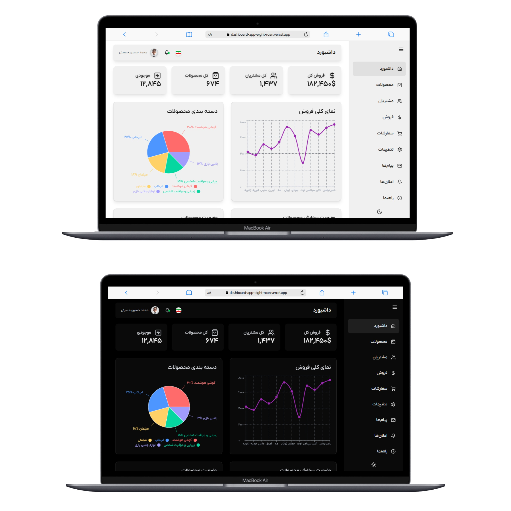
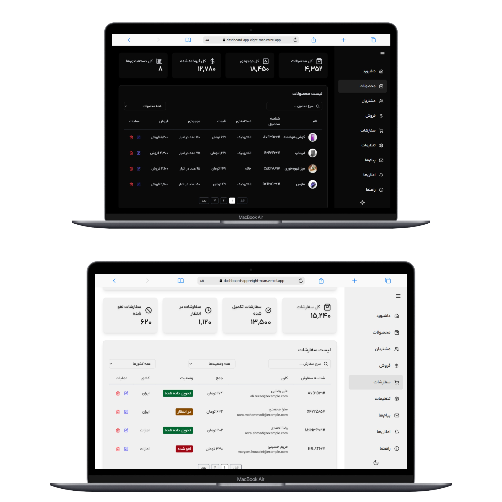

# 📊 Dashboard App - Next.js + TypeScript + Tailwind CSS + Framer Motion

This project is a **modern, responsive dashboard application** built using **Next.js**, **TypeScript**, **Tailwind CSS**, and **Framer Motion**. It includes **light and dark themes**, smooth page transitions, and fully functional dashboard components tailored for both desktop and mobile devices.

---

## Live Demo
You can check out the live demo of the project at the following link : [Dashboard](https://dashboard-app-eight-roan.vercel.app/)

---

## ✨ Features

- ⚙️ Built with **Next.js 15** and **TypeScript**
- 🎨 Fully styled using **Tailwind CSS**
- 🌗 Supports **Dark Mode** and **Light Mode**
- 📱 Fully **responsive** on all devices (mobile, tablet, desktop)
- 🧩 Modular and scalable component structure
- 💫 Smooth animations with **Framer Motion**
- 🧭 Functional UI components for different dashboard sections

---

## 🛠️ Tech Stack

- **Next.js**
- **TypeScript**
- **Tailwind CSS**
- **Framer Motion**

---

## 🚀 Getting Started

### Prerequisites

- Node.js (v16 or higher)
- npm or yarn

### Installation

```bash
# Clone the repository
git clone https://github.com/hamedhmd88/Dashboard-app

# Navigate into the project directory
cd your-dashboard

# Install dependencies
npm install
# or
yarn install
```

## 📸 Sample Screenshot

Below is a sample screenshot of the project:




